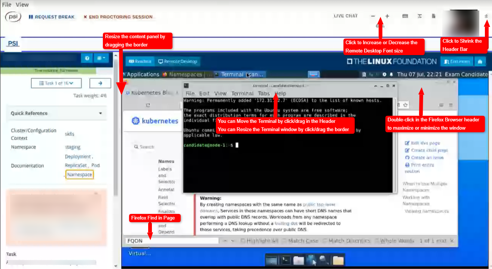
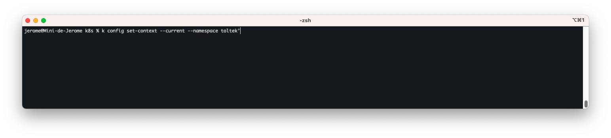
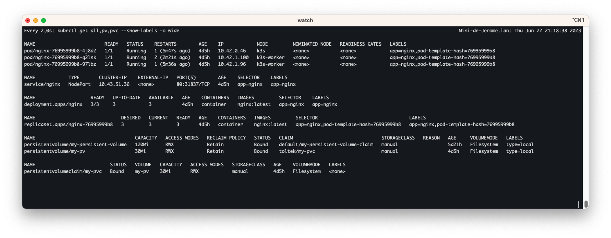
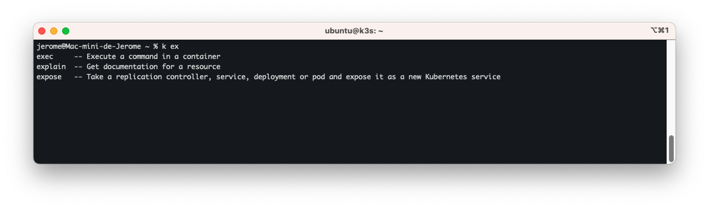

#### Remote Desktop

En juin 2022, l'interface d'examen a été modifiée passant d'un terminal à distance à un bureau à distance (Ubuntu XFCE). Vous n'êtes autorisé à utiliser que le navigateur Firefox à l'intérieur du bureau à distance pour accéder à la documentation K8s, et non votre navigateur local. Si vous venez d'OSX/Windows, il y aura des changements au niveau du copier-coller. Nous avons rédigé un article décrivant la nouvelle interface utilisateur, et la Linux Foundation a publié une mise à jour. Il existe également un environnement de test (playground) qui vous permet de tester une interface similaire.

Il existe toujours des différences entre les vrais examens et les simulateurs, notamment :

Vous devrez utiliser le navigateur sécurisé PSI pour accéder aux vrais examens, tandis que vous pouvez utiliser Chrome/Firefox pour accéder aux simulateurs.  

Dans le bureau à distance des vrais examens, vous ne pouvez accéder qu'à certaines URL autorisées dans Firefox, tandis qu'il n'y a pas de telles restrictions dans les simulateurs. 

Dans les simulateurs, vous pouvez utiliser la navigation supérieure de l'interface d'examen pour revenir à l'ancien terminal à distance en cas de problème (informez-nous de tout problème via le support), ce qui n'est pas possible dans les vrais examens.

certification passée sur un moniteur 3440*1440 (pas de gros lags)

#### Proctor

* pas de bijoux / bracelets / boucles d'oreilles
* Il va vouloir contrôler les oreilles et la barbe
* contrôle sous l'ordinateur portable / sous le clavier / sous la souris / sous la table
* pas de téléphone sur la table
* vérification du plafond et 360° de la pièce au ralenti
* ne pas parler / bouger les lèvres
* ne pas mettre la main devant la bouche
* Utiliser vim dans une fenêtre comme bloc-note

---

#### VIM

pour rechercher une ou plusieurs occurrences dans vim : utiliser la touche `/`

pour sélectionner plusieurs lignes:  `MAJ + V` et ensuite flèche haut ou flèche bas

indentation vers la droite:  `:\>`

indentation vers la gauche:  `:\<`

suppression d'une ligne:  `dd`

remplacer toutes les occurences par une autre:  `:%s/hello/world/g`


---

#### CLI
 je recommande d'ouvrir dès la sessions plusieurs CLI

##### Utiliser un terminal toujours actif servant à pointer sur le namespace de la question. (ici requirednamespace)



```shell
k config set-context --current --namespace requirednamespace

```

##### Utiliser un terminal toujours actif servant à visionner les principales resources actives.



```shell
watch kubectl get all,pv,pvc --show-labels -o wide
```

##### Utiliser un troisieme terminal pour effectuer les tâches.


##### autocompletion. (déjà configurée)

```shell
alias k='kubectl'
complete -F __start_kubectl k
```

##### dry-run

```shell
--dry-run=client -o yaml
```

##### force delete

```shell
--force --grace-period 0
```

##### use context. (ici requiredcontext)

```shell
k config use-context requiredcontext
```

##### eviter que la requête se termine, accès direct au prompt.

```shell
k delete pod nginx --wait=false
```


Pour les services favoriser la commande **expose** (avec l'option --type) plutôt que de chercher un fichier yaml sur kubernetes.io/docs

```shell
k expose deploy nginx --type='ClusterIP/NodePort/LoadBalancer/ExternalName'  
Default is 'ClusterIP'.     
```

Pour les ingress. 
**Penser à  récuperer la classe ingress nécessaire.**

```shell
k get ingressclasses
NAME      CONTROLLER                      PARAMETERS   AGE
traefik   traefik.io/ingress-controller   <none>       8d
```

---

##### Faire des Recherches

Utilisez les lignes de commande plutôt que de rechercher dans firefox. ex:

```shell
k get -h 
```

```shell
k expose -h | less (q pour quitter)
```

```shell
k  explain storageclass 
```

```shell
k create cronjob -h
```

petit plus sous zsh (uniquement). Completion de commande kubectl



`Tab` suggère les commandes qui peuvent être rajoutées à la requête

`CTRL + MAJ + D` suggère les commandes qui peuvent être rajoutées à la requête tout en donnant une explication.


---


si vraiment vous ne trouvez pas l'info, passez sur Firefox (lent en mars 2023 / acceptable en juin 2023)
Utilisez les touches page-up et page down au lieu de la souris (lag de la VM) et favoriser les recherches ciblées ex "**secretKeyRef:**" "**kind : PersistentVolumeClaim**"


---

Voilà ;)  
Bonne chance !!!


